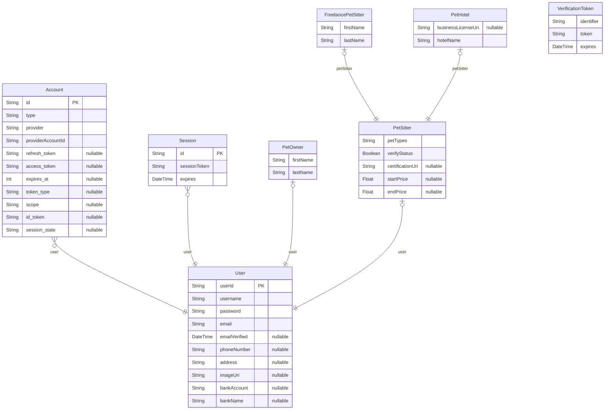

```mermaid
erDiagram

  Account {
    String id PK 
    String type  
    String provider  
    String providerAccountId  
    String refresh_token  "nullable"
    String access_token  "nullable"
    Int expires_at  "nullable"
    String token_type  "nullable"
    String scope  "nullable"
    String id_token  "nullable"
    String session_state  "nullable"
    }
  

  Session {
    String id PK 
    String sessionToken  
    DateTime expires  
    }
  

  User {
    String userId PK 
    String username  
    String password  
    String email  
    DateTime emailVerified  "nullable"
    String phoneNumber  "nullable"
    String address  "nullable"
    String imageUri  "nullable"
    String bankAccount  "nullable"
    String bankName  "nullable"
    }
  

  PetOwner {
    String firstName  
    String lastName  
    }
  

  PetSitter {
    String petTypes  
    Boolean verifyStatus  
    String certificationUri  "nullable"
    Float startPrice  "nullable"
    Float endPrice  "nullable"
    }
  

  FreelancePetSitter {
    String firstName  
    String lastName  
    }
  

  PetHotel {
    String businessLicenseUri  "nullable"
    String hotelName  
    }
  

  VerificationToken {
    String identifier  
    String token  
    DateTime expires  
    }
  
    Account o{--|| User : "user"
    Session o{--|| User : "user"
    PetOwner o|--|| User : "user"
    PetSitter o|--|| User : "user"
    FreelancePetSitter o|--|| PetSitter : "petSitter"
    PetHotel o|--|| PetSitter : "petSitter"
```
