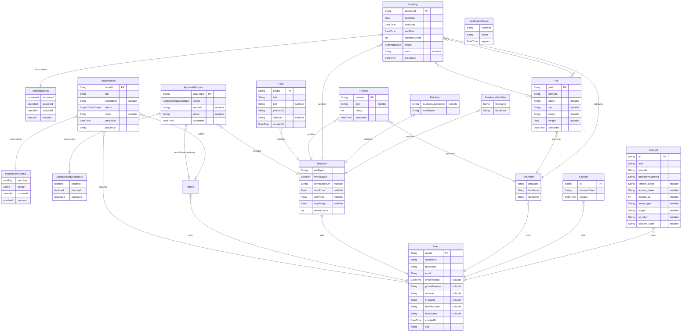

```mermaid
erDiagram

        BookingStatus {
            requested requested
accepted accepted
canceled canceled
rejected rejected
        }
    


        ReportTicketStatus {
            pending pending
acked acked
canceled canceled
resolved resolved
        }
    


        ApprovalRequestStatus {
            pending pending
declined declined
approved approved
        }
    
  Account {
    String id PK 
    String type  
    String provider  
    String providerAccountId  
    String refresh_token  "nullable"
    String access_token  "nullable"
    Int expires_at  "nullable"
    String token_type  "nullable"
    String scope  "nullable"
    String id_token  "nullable"
    String session_state  "nullable"
    }
  

  Session {
    String id PK 
    String sessionToken  
    DateTime expires  
    }
  

  User {
    String userId PK 
    String username  
    String password  
    String email  
    DateTime emailVerified  "nullable"
    String phoneNumber  "nullable"
    String address  "nullable"
    String imageUri  "nullable"
    String bankAccount  "nullable"
    String bankName  "nullable"
    DateTime createdAt  
    String salt  
    }
  

  PetOwner {
    String petTypes  
    String firstName  
    String lastName  
    }
  

  PetSitter {
    String petTypes  
    Boolean verifyStatus  
    String certificationUri  "nullable"
    Float startPrice  "nullable"
    Float endPrice  "nullable"
    Float avgRating  "nullable"
    Int reviewCount  
    }
  

  FreelancePetSitter {
    String firstName  
    String lastName  
    }
  

  PetHotel {
    String businessLicenseUri  "nullable"
    String hotelName  
    }
  

  Booking {
    String bookingId PK 
    Float totalPrice  
    DateTime startDate  
    DateTime endDate  
    Int numberOfPets  
    BookingStatus status  
    String note  "nullable"
    DateTime createdAt  
    }
  

  Pet {
    String petId PK 
    String petType  
    String name  "nullable"
    String sex  "nullable"
    String breed  "nullable"
    Float weight  "nullable"
    DateTime createdAt  
    }
  

  VerificationToken {
    String identifier  
    String token  
    DateTime expires  
    }
  

  Review {
    String reviewId PK 
    String text  "nullable"
    Int rating  
    DateTime createdAt  
    }
  

  Post {
    String postId PK 
    String title  
    String text  "nullable"
    String pictureUri  
    String videoUri  "nullable"
    DateTime createdAt  
    }
  

  Admin {

    }
  

  ReportTicket {
    String ticketId PK 
    String title  
    String description  "nullable"
    ReportTicketStatus status  
    String notes  "nullable"
    DateTime createdAt  
    String pictureUri  
    }
  

  ApprovalRequest {
    String requestId PK 
    ApprovalRequestStatus status  
    String adminId  "nullable"
    String notes  "nullable"
    DateTime createdAt  
    }
  
    Account o{--|| User : "user"
    Session o{--|| User : "user"
    PetOwner o|--|| User : "user"
    PetSitter o|--|| User : "user"
    FreelancePetSitter o|--|| PetSitter : "petSitter"
    PetHotel o|--|| PetSitter : "petSitter"
    Booking o{--|| PetOwner : "petOwner"
    Booking o{--|| PetSitter : "petSitter"
    Booking o{--}o Pet : ""
    Booking o|--|| BookingStatus : "enum:status"
    Pet o{--|| PetOwner : "petOwner"
    Pet o{--}o Booking : ""
    Review o{--|| PetOwner : "petOwner"
    Review o{--|| PetSitter : "petSitter"
    Post o{--|| PetSitter : "petSitter"
    Admin o{--|| User : "user"
    ReportTicket o{--|| User : "reporter"
    ReportTicket o{--|o Admin : "admin"
    ReportTicket o|--|| ReportTicketStatus : "enum:status"
    ApprovalRequest o{--|| PetSitter : "petSitter"
    ApprovalRequest o|--|| ApprovalRequestStatus : "enum:status"
    ApprovalRequest o{--|o Admin : "latestStatusUpdateby"
```
