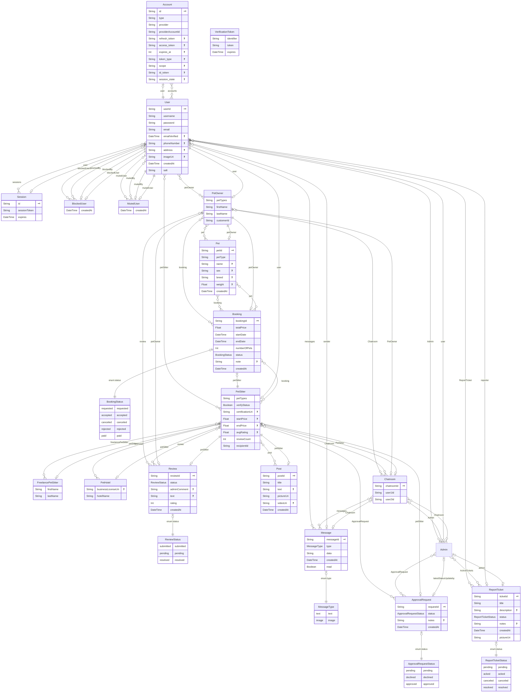

```mermaid
erDiagram

        BookingStatus {
            requested requested
accepted accepted
canceled canceled
rejected rejected
paid paid
        }
    


        ReviewStatus {
            submitted submitted
pending pending
resolved resolved
        }
    


        ReportTicketStatus {
            pending pending
acked acked
canceled canceled
resolved resolved
        }
    


        ApprovalRequestStatus {
            pending pending
declined declined
approved approved
        }
    


        MessageType {
            text text
image image
        }
    
  "Account" {
    String id "🗝️"
    String type 
    String provider 
    String providerAccountId 
    String refresh_token "❓"
    String access_token "❓"
    Int expires_at "❓"
    String token_type "❓"
    String scope "❓"
    String id_token "❓"
    String session_state "❓"
    }
  

  "Session" {
    String id "🗝️"
    String sessionToken 
    DateTime expires 
    }
  

  "User" {
    String userId "🗝️"
    String username 
    String password 
    String email 
    DateTime emailVerified "❓"
    String phoneNumber "❓"
    String address "❓"
    String imageUri "❓"
    DateTime createdAt 
    String salt 
    }
  

  "BlockedUser" {
    DateTime createdAt 
    }
  

  "MutedUser" {
    DateTime createdAt 
    }
  

  "PetOwner" {
    String petTypes 
    String firstName 
    String lastName 
    String customerId 
    }
  

  "PetSitter" {
    String petTypes 
    Boolean verifyStatus 
    String certificationUri "❓"
    Float startPrice "❓"
    Float endPrice "❓"
    Float avgRating "❓"
    Int reviewCount 
    String recipientId 
    }
  

  "FreelancePetSitter" {
    String firstName 
    String lastName 
    }
  

  "PetHotel" {
    String businessLicenseUri "❓"
    String hotelName 
    }
  

  "Booking" {
    String bookingId "🗝️"
    Float totalPrice 
    DateTime startDate 
    DateTime endDate 
    Int numberOfPets 
    BookingStatus status 
    String note "❓"
    DateTime createdAt 
    }
  

  "Pet" {
    String petId "🗝️"
    String petType 
    String name "❓"
    String sex "❓"
    String breed "❓"
    Float weight "❓"
    DateTime createdAt 
    }
  

  "VerificationToken" {
    String identifier 
    String token 
    DateTime expires 
    }
  

  "Review" {
    String reviewId "🗝️"
    ReviewStatus status 
    String adminComment "❓"
    String text "❓"
    Int rating 
    DateTime createdAt 
    }
  

  "Post" {
    String postId "🗝️"
    String title 
    String text "❓"
    String pictureUri 
    String videoUri "❓"
    DateTime createdAt 
    }
  

  "Admin" {

    }
  

  "ReportTicket" {
    String ticketId "🗝️"
    String title 
    String description "❓"
    ReportTicketStatus status 
    String notes "❓"
    DateTime createdAt 
    String pictureUri 
    }
  

  "ApprovalRequest" {
    String requestId "🗝️"
    ApprovalRequestStatus status 
    String notes "❓"
    DateTime createdAt 
    }
  

  "Chatroom" {
    String chatroomId "🗝️"
    String user1Id 
    String user2Id 
    }
  

  "Message" {
    String messageId "🗝️"
    MessageType type 
    String data 
    DateTime createdAt 
    Boolean read 
    }
  
    "Account" o|--|| "User" : "user"
    "Session" o|--|| "User" : "user"
    "User" o{--}o "PetOwner" : "petOwner"
    "User" o{--}o "PetSitter" : "petSitter"
    "User" o{--}o "Account" : "accounts"
    "User" o{--}o "Session" : "sessions"
    "User" o{--}o "Admin" : "Admin"
    "User" o{--}o "ReportTicket" : "ReportTicket"
    "User" o{--}o "Message" : "messages"
    "User" o{--}o "BlockedUser" : "blockedUsers"
    "User" o{--}o "BlockedUser" : "blockedBy"
    "User" o{--}o "MutedUser" : "mutedUser"
    "User" o{--}o "MutedUser" : "mutedBy"
    "BlockedUser" o|--|| "User" : "blockedBy"
    "BlockedUser" o|--|| "User" : "blockedUser"
    "MutedUser" o|--|| "User" : "mutedBy"
    "MutedUser" o|--|| "User" : "mutedUser"
    "PetOwner" o|--|| "User" : "user"
    "PetOwner" o{--}o "Pet" : "pet"
    "PetOwner" o{--}o "Booking" : "booking"
    "PetOwner" o{--}o "Review" : "review"
    "PetOwner" o{--}o "Chatroom" : "Chatroom"
    "PetSitter" o|--|| "User" : "user"
    "PetSitter" o{--}o "FreelancePetSitter" : "freelancePetSitter"
    "PetSitter" o{--}o "PetHotel" : "petHotel"
    "PetSitter" o{--}o "Booking" : "booking"
    "PetSitter" o{--}o "Post" : "post"
    "PetSitter" o{--}o "Review" : "review"
    "PetSitter" o{--}o "Chatroom" : "Chatroom"
    "PetSitter" o{--}o "ApprovalRequest" : "ApprovalRequest"
    "FreelancePetSitter" o|--|| "PetSitter" : "petSitter"
    "PetHotel" o|--|| "PetSitter" : "petSitter"
    "Booking" o|--|| "PetOwner" : "petOwner"
    "Booking" o|--|| "PetSitter" : "petSitter"
    "Booking" o{--}o "Pet" : "pet"
    "Booking" o|--|| "BookingStatus" : "enum:status"
    "Pet" o|--|| "PetOwner" : "petOwner"
    "Pet" o{--}o "Booking" : "booking"
    "Review" o|--|| "PetOwner" : "petOwner"
    "Review" o|--|| "PetSitter" : "petSitter"
    "Review" o|--|| "ReviewStatus" : "enum:status"
    "Post" o|--|| "PetSitter" : "petSitter"
    "Admin" o|--|| "User" : "user"
    "Admin" o{--}o "ReportTicket" : "ActiveTickets"
    "Admin" o{--}o "ApprovalRequest" : "ApprovalRequest"
    "Admin" o{--}o "Chatroom" : "Chatroom"
    "ReportTicket" o|--|| "User" : "reporter"
    "ReportTicket" o|--|o "Admin" : "admin"
    "ReportTicket" o|--|| "ReportTicketStatus" : "enum:status"
    "ApprovalRequest" o|--|| "PetSitter" : "petSitter"
    "ApprovalRequest" o|--|| "ApprovalRequestStatus" : "enum:status"
    "ApprovalRequest" o|--|o "Admin" : "latestStatusUpdateby"
    "Chatroom" o{--}o "Message" : "messages"
    "Chatroom" o|--|o "PetOwner" : "PetOwner"
    "Chatroom" o|--|o "PetSitter" : "PetSitter"
    "Chatroom" o|--|o "Admin" : "Admin"
    "Message" o|--|| "MessageType" : "enum:type"
    "Message" o|--|| "User" : "sender"
    "Message" o|--|o "Chatroom" : "Chatroom"
```
